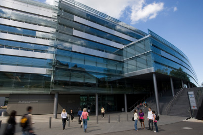
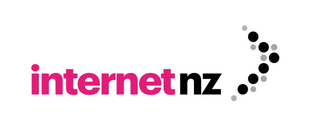
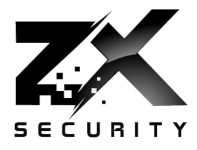

## 19 - 21 February 2020 - Auckland

-----

## Important Links

* [Pre-Conference Training - 19-21 February](training/)
* [Conference Schedule - 21 February](schedule/)
  * [Presentation Abstracts and Speaker Bios](speakers/)   
* [About Our Sponsors](sponsors/)
* [Call for Volunteers](volunteers/)
* [Call for Sponsorships](sponsorship/)
* [Diversity Fund](diversity-fund/)
* [International Attendees](international/)
* [Code of Conduct](conduct/)

We are proud to announce the eleventh OWASP New Zealand Day conference, to be held at the University of Auckland on Friday, February 21st, 2020. OWASP New Zealand Day is a one-day conference dedicated to information security, with an emphasis on secure architecture and development techniques to help Kiwi developers build more secure applications.

There will be three streams throughout the day. The first stream will include introductory talks on application and information security topics, as well as on policy, compliance, and risk management. The second stream will primarily address deeper technical topics. The third stream - new for 2020 - will include talks on OWASP Projects and Tools, presented by leaders of and contributors to those projects.

Who is it for?

* Web Developers
* Security Professionals and Enthusiasts
* Program and Project Managers
* Business Analysts
* Requirements Analysts
* Software Testers

## Conference Structure

**Date:** Friday, 21 February 2020  
**Time:** 9:00 a.m. - 6:30 p.m.  
**Cost: FREE**  

The main conference is on Friday, the 21st of February, and will have three streams throughout the day:

**Stream One:**
* Introductory Topics
* Program Management, Policy, Compliance, Risk Management

**Stream Two:**
* Technical Topics

**Stream Three:**
* OWASP Projects and Tools

As a new feature for 2020, we have added a vendor exhibition area in the lower-level lobby. Representatives from each of our Premier Sponsors will be on hand throughout the day, to answer your questions about their products and services. There will be door prize drawings at the Closing Session on Friday. To qualify for the drawings, you will need to visit with each sponsor during the day, and have them stamp your entry card.

## Keynote Speaker

We are excited to announce that Jim Manico, founder of Manicode Security and a co-leader of the OWASP Application Security Verification Standard (ASVS), Top Ten Proactive Controls, and Cheat Sheets Projects, will present our opening keynote, entitled "**The Abridged History of Application Security**."

## Training

In addition to the main conference on Friday, we are pleased to be offer training opportunities on Wednesday and Thursday, at the same venue. Course details can be found on the **[Pre-Conference Training](training/)** page, and you can register for training on [EventBrite](https://owaspnz2020-training.eventbrite.com) **(CLOSED)**.

**Training Fees:** $1250.00 for two-day sessions; $625.00 for one-day sessions; $325.00 for half-day sessions (plus EventBrite fees)

## General

The eleventh OWASP New Zealand Day will be happening thanks to the support provided by the University of Auckland, which will kindly offer the same facilities as those we used in previous years. The main conference will continue to be free, thanks to the generous support of our sponsors.

For any comments, feedback or observations, please don't hesitate to [contact us](mailto:new-zealand-day@owasp.org).

## Registration

Registration opened on 15 December 2019.

To register for the main conference, visit the [OWASP NZ Day 2020 Registration Site](https://owaspnz2020.eventbrite.com) on EventBrite. Walk-in registrations will be accepted *only if* the conference has not reached capacity.

Registration for Pre-Conference training is now open, and will close on 12 February, or when all seats are sold. To reserve training seats for you and your team, visit the [Training Registration Site](https://owaspnz2020-training.eventbrite.com) on EventBrite. For more information on the training classes offered, visit the **[Pre-Conference Training](training/)** page.

Please join our low volume [Google Groups mailing list](https://groups.google.com/a/owasp.org/forum/#!forum/new-zealand-chapter@owasp.org/join) to be notified as further schedule information becomes available, and/or follow us on Twitter ([@owaspnz](https://www.twitter.com/owaspnz)).

## Important Dates

* **CFP and CFT Opened:**: 1 October 2019
* **CFP First-Round Deadline:** 15 November 2019
* **CFT Submission Deadline:** 30 November 2019 (**CFT Closed**)
* **CFP Second-Round Deadline:** 15 December 2019 (**CFP Closed**)
* **Registration Opened:** 15 December 2019
* **Training Registration Closed:** 12 February 2020
* **Pre-Conference Training Dates:** 19-20 February 2020
* **Main Conference Date:** 21 February 2020
* **Conference Registration Deadline:** 21 February 2020 (On-site registration permitted, if space is available)

## Places to Eat and Drink on the Day
 
The University has published a [handy, updated map](assets/docs/Retail Map_University_of_Auckland_2020.pdf), to help you find places to eat around campus.

Some of the options available:
* The Deli - Located on Level 1 of the Owen G. Glenn Building - This is closest, but will probably have long lines
* Mojo Symonds - also on campus
* Shakey Isles - coffee and food across the road on the corner of Symonds & Alfred St
* Around the CBD - walk up and over Albert Park to get to the CBD with many great food options
    * Fort Street has burgers, kebabs, and KFC
    * High Street & Lorne Street have lots of little cafes and restaurants
* Subway, Starbucks, St. Pierre's Sushi & Pita Pit - walk up Symonds Street
* Vulture’s Lane is a popular pub with the InfoSec crowd, there are more seats downstairs
* The Bluestone Room - also a popular pub just across Queen St

## Conference Venue

 

**Location:**  
    The University of Auckland School of Business   
    Owen G. Glenn Building (OGGB)   
    12 Grafton Road, Grafton, Auckland  
    **Map:** [Google Maps](https://goo.gl/maps/YfEnnxaqkGvaoqXz6)
    
**Stream One:** Level 1   
**Room:** 115 (Fisher & Paykel Appliances Auditorium)

**Stream Two:** Level 0   
**Room:** 098 Lecture Theatre

**Stream Three:** Level 0   
**Room:** 051 (OGGB 5)

## Conference Sponsors

For more information on our Premier Sponsors, please visit our [About Our Sponsors](sponsors/) page.

### Conference Host

   

### Platinum Sponsors

|:---:|:---:|
|{:width="400px" target="_blank" rel="sponsored"}|{:width="400px" target="_blank" rel="sponsored"}|

### Gold Sponsors

|:---:|:---:|:---:|
|{:width="250px" target="_blank" rel="sponsored"}|{:width="250px" target="_blank" rel="sponsored"}|{:width="250px" target="_blank" rel="sponsored"}|
|{:width="250px" target="_blank" rel="sponsored"}|{:width="250px" target="_blank" rel="sponsored"}|{:width="250px" target="_blank" rel="sponsored"}|
|{:width="250px" target="_blank" rel="sponsored"}|{:width="250px" target="_blank" rel="sponsored"}|{:width="250px" target="_blank" rel="sponsored"}|   

### Silver Sponsors

|:---:|:---:|
|{:width="250px" target="_blank" rel="sponsored"}||   

Follow us on Twitter [@owaspnz](https://www.twitter.com/owaspnz)

[OWASP New Zealand on Facebook](https://www.facebook.com/owaspnz)
