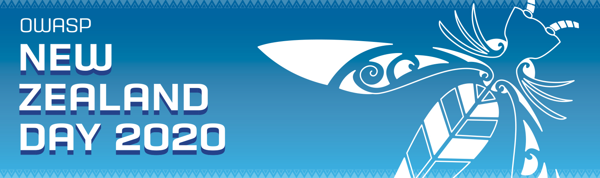

[Back to Conference Home Page](/www-event-2020-NewZealandDay)

# Conference Schedule

## Friday, 21 February 2020

<table width="100%">
  <tr>
    <td style="vertical-align: top; text-align: right;">08:00</td>
    <td colspan="5" style="background-color: #8595C2; text-align: center;">
      Registration Opens - Main Foyer, Owen G. Glenn Building
    </td>
  </tr>
  <tr>
    <td valign="top" align="right">09:00</td>
    <td colspan="5" style="background-color: #D98B66; text-align: center;">
      <strong>Welcome to OWASP New Zealand Day 2020</strong>
       
      <em>John DiLeo (Conference Chair) and Kirk Jackson - OWASP New Zealand Chapter Leaders Lech Janczewski (Conference Host) - Associate Professor, Univ. of Auckland</em>
    </td>
  </tr>
  <tr>
    <td valign="top" align="right">09:20</td>
    <td colspan="5" style="background-color: #8595C2; text-align: center;">
      <strong>Opening Keynote: The Abridged History of Application Security</strong>
       
      <em>Jim Manico - Founder, Manicode Security; Co-Leader, OWASP Application Security Verification Standard (ASVS) and Proactive Controls Projects</em>
    </td>
  </tr>
  <tr>
    <td style="width: 6%; vertical-align: top; text-align: right;">&nbsp;</td>
    <td style="background-color: #B9C2DC; text-align: center; width: 27%; font-weight: bold;">
      Upstairs Auditorium (Room 115)
       
      Track One: Introductory / Management
    </td>
    <td style="width: 6%; vertical-align: top; text-align: right;">&nbsp;</td>
    <td style="background-color: #B9C2DC; text-align: center; width: 27%; font-weight: bold;">
      Downstairs Auditorium (Room 098)
       
      Track Two: Technical
    </td>
    <td style="width: 6%; vertical-align: top; text-align: right;">&nbsp;</td>
    <td style="background-color: #B9C2DC; text-align: center; width: 27%; font-weight: bold;">
      Downstairs Lecture Hall OGGB5 (Room 051)
       
      Track Three: OWASP Projects and Tools
    </td>
  </tr>
  <tr>
    <td style="vertical-align: top; text-align: right;">10:10</td>
    <td style="background-color: #EEE; text-align: center;">
      <strong>High-Speed Security</strong>
       
      <em>Nick von Dadelszen - Lateral Security</em>
    </td>
    <td style="vertical-align: top; text-align: right;">10:10</td>
    <td style="background-color: #EEE; text-align: center">
      <strong>A Pentester's Guide to Automating Security</strong>
       
      <em>Benjamin Kearns (pipeline) - Lateral Security</em>
    </td>
    <td style="vertical-align: top; text-align: right;">10:10</td>
    <td style="background-color: #EEE; text-align: center">
      <strong>OWASP Top 10 Overview</strong>
       
      <em>Kirk Jackson - Co-Leader, OWASP New Zealand Chapter</em>
    </td>
  </tr>
  <tr>
    <td style="vertical-align: top; text-align: right;" rowspan="2">10:45</td>
    <td style="background-color: #B9C2DC; text-align: center;" rowspan="2">
      <strong>The Perimeter Has Been Shattered: Attacking and Defending Mobility and IoT on the Enterprise Network</strong>
       
      <em>Georgia Weidman - Bulb Security</em>
    </td>
    <td style="vertical-align: top; text-align: right;">10:45</td>
    <td style="background-color: #B9C2DC; text-align: center;">
      <strong>Improving Identity Management with W3C Verifiable Credentials</strong>
       
      <em>David Chadwick - University of Kent</em>
    </td>
    <td style="vertical-align: top; text-align: right;" rowspan="2">10:45</td>
    <td style="background-color: #B9C2DC; text-align: center" rowspan="2">
      <strong>Building Secure Mobile Apps: You don’t have to learn it the hard way!</strong>
       
      <em>Sven Schleier - Co-Leader, OWASP MSTG and MASVS Projects</em>
    </td>
  </tr>
  <tr>
    <td style="width: 6%; vertical-align: top; text-align: right;">11:20</td>
    <td style="background-color: #EEE; text-align: center">
      <strong>Scanning Your Container Images using Anchore</strong>
       
      <em>Vince Sesto - Foodstuffs North Island</em>
    </td>
  </tr>
  <tr>
    <td style="vertical-align: top; text-align: right;">11:40</td>
    <td style="background-color: #EEE; text-align: center">
      <strong>What's the Worst That Could Happen?</strong>
       
      <em>Petra Smith - Aura Information Security</em>
    </td>
    <td style="vertical-align: top; text-align: right;">11:40</td>
    <td style="background-color: #B9C2DC; text-align: center">
      <strong>Teaching an Old Dog New Tricks</strong>
       
      <em>Brett Moore - Insomnia Security Specialists</em>
    </td>
    <td style="vertical-align: top; text-align: right;">&nbsp;</td>
    <td style="background-color: #EEE; text-align: center">&nbsp;</td>
  </tr>
 <tr>
    <td style="vertical-align: top; text-align: right;">12:30</td>
    <td colspan="5" style="background-color: #D98B66; text-align: center; font-weight: bold;">Break for Lunch - On Your Own</td>
  </tr>
  <tr>
    <td style="vertical-align: top; text-align: right;">13:30</td>
    <td style="background-color: #EEE; text-align: center">
      <strong>Māori Cultural and Ethical Considerations in Information Security</strong>
       
      <em>Karaitiana Taiuru</em></td>
    <td rowspan="2" style="vertical-align: top; text-align: right;">13:30</td>
    <td rowspan="2" style="background-color: #EEE; text-align: center">
      <strong>Wyh Ranmdnoses Mattres</strong>
       
      <em>Frans Lategan - Aura Information Security</em>
    </td>
    <td rowspan="2" style="vertical-align: top; text-align: right;">13:30</td>
    <td rowspan="2" style="background-color: #EEE; text-align: center">
      <strong>OWASP Project Overviews: Top Ten, ASVS, Proactive Controls, Java Encoder, HTML Sanitizer</strong>
       
      <em>Jim Manico</em>
    </td>
  </tr>
  <tr>
    <td style="vertical-align: top; text-align: right;">14:05</td>
    <td style="background-color: #B9C2DC; text-align: center">
      <strong>Mūrere me te haumarutanga</strong>
       
      <em>Chris Cormack - Catalyst IT</em>
    </td>
  </tr>
  <tr>
    <td style="vertical-align: top; text-align: right;">14:25</td>
    <td style="background-color: #EEE; text-align: center">
      <strong>Small, but fierce (but still small)</strong>  
         
      <em>Erica Anderson (@Sputina) - SafeStack</em>
    </td>
    <td style="vertical-align: top; text-align: right;">14:25</td>
    <td style="background-color: #B9C2DC; text-align: center">
      <strong>Web App Attacks of the Modern World</strong>
       
      <em>Karan Sharma</em>
    </td>
    <td rowspan="2" style="vertical-align: top; text-align: right;">&nbsp;</td>
    <td rowspan="2" style="background-color: #B9C2DC; text-align: center">&nbsp;</td>
  </tr>
  <tr>
    <td style="vertical-align: top; text-align: right;">15:00</td>
    <td style="background-color: #B9C2DC; text-align: center">
      <strong>Keeping Up with the Joneses: Security from a Developer's Perspective</strong>
       
      <em>Toni James - Lateral Security</em>
    </td>
    <td style="vertical-align: top; text-align: right;">15:00</td>
    <td style="background-color: #EEE; text-align: center">
      <strong>Use OSINT to Keep Up with AWS</strong>
       
      <em>Oliver (Olly) Ewert</em>
    </td>
  </tr>
  <tr>
    <td style="vertical-align: top; text-align: right;">15:30</td>
    <td colspan="5" style="background-color: #D98B66; text-align: center; font-weight: bold;">Break for Afternoon Tea</td>
  </tr>
  <tr>
    <td rowspan="2" style="vertical-align: top; text-align: right;">16:00</td>
    <td rowspan="2" style="background-color: #EEE; text-align: center">
      <strong>Same-origin policy: The Core of Web Security</strong>
       
      <em>Kirk Jackson - Red Shield</em>
    </td>
    <td style="vertical-align: top; text-align: right;">16:00</td>
    <td style="background-color: #EEE; text-align: center">
      <strong>Security in our code reviews? Check!</strong>
       
      <em>Daniel Zollinger - SafeStack</em>
    </td>
    <td rowspan="2" style="vertical-align: top; text-align: right;">16:00</td>
    <td rowspan="2" style="background-color: #EEE; text-align: center;">
      <strong>OWASP SAMM2: Your Dynamic Software Security Journey</strong>
       
      <em>John Ellingsworth - Co-Author, OWASP SAMM Project</em>
    </td>
  </tr>
  <tr>
    <td style="vertical-align: top; text-align: right;">&nbsp;</td>
    <td style="background-color: #B9C2DC; text-align: center">&nbsp; &nbsp;</td>
  </tr>
  <tr>
    <td style="vertical-align: top; text-align: right;">16:55</td>
    <td style="background-color: #B9C2DC; text-align: center">
      <strong>Fighting an Uneven Battle: Simplicity versus Complexity in Web App Security</strong>
       
      <em>Sergey Ozernikov</em>
    </td>
    <td style="vertical-align: top; text-align: right;">16:55</td>
    <td style="background-color: #EEE; text-align: center">
      <strong>A Recipe for Password Storage: Add Salt to Taste</strong>
       
      <em>Nick Malcolm - Aura Information Security</em>
    </td>
    <td rowspan="2" style="vertical-align: top; text-align: right;">&nbsp;</td>
    <td rowspan="2" style="background-color: #B9C2DC; text-align: center">&nbsp;</td>
  </tr>
  <tr>
    <td style="vertical-align: top; text-align: right;">17:30</td>
    <td style="background-color: #EEE; text-align: center">
      <strong>PCI-DSS-WTF?</strong>
       
      <em>Peter Jakowetz - Ministry of Justice</em>
    </td>
    <td style="vertical-align: top; text-align: right;">17:30</td>
    <td style="background-color: #B9C2DC; text-align: center">
      <strong>Self-Service SSH Certificates</strong>
       
      <em>Jeremy Stott</em>
    </td>
  </tr>
  <tr>
    <td style="vertical-align: top; text-align: right;">18:05</td>
    <td colspan="5" style="background-color: #D98B66; text-align: center;">
      <strong>Wrap Up - Closing Remarks, Recognition, Prize Giving</strong>
       
      <em>Post-Conference: Time to go out and socialise, for those interested</em>
    </td>
  </tr>
</table>
